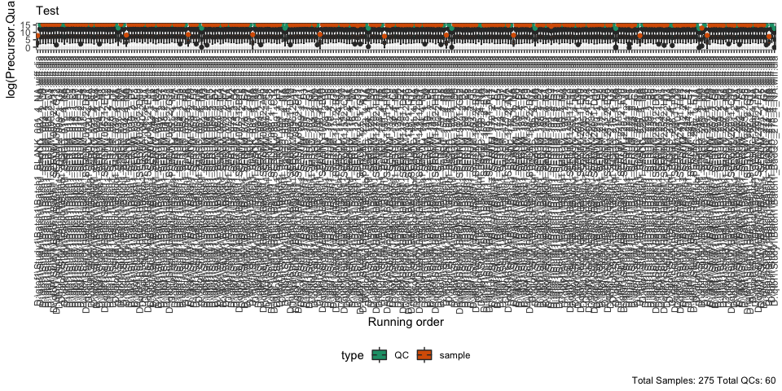
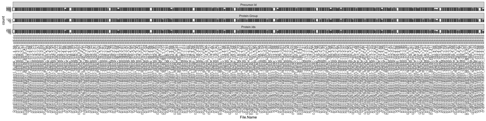
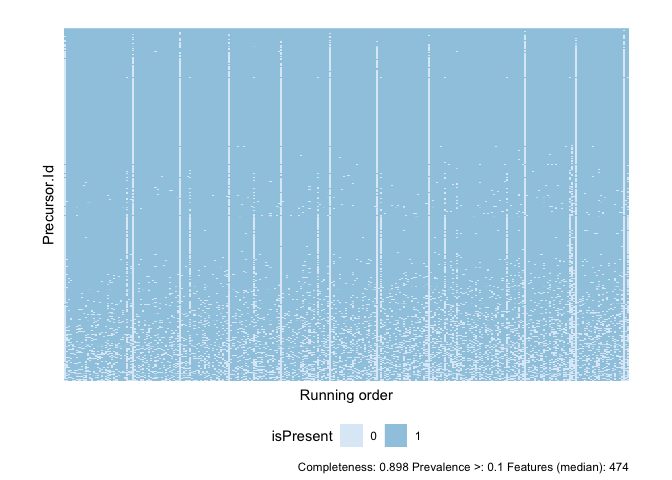

<!-- README.md is generated from README.Rmd. Please edit that file -->

# proteomicsQC

<!-- badges: start -->
<!-- badges: end -->

The goal of proteomicsQC is to …

## Installation

``` r
library(devtools)
#> Loading required package: usethis
```

You can install the released version of proteomicsQC from
[github](https://github.com/alzel/proteomicsQC) with:

``` r
#install_github(repo = "alzel/proteomicsQC")
library(proteomicsQC)
```

``` r
library(tidyverse)
#> ── Attaching packages ─────────────────────────────────────── tidyverse 1.3.1 ──
#> ✓ ggplot2 3.3.5     ✓ purrr   0.3.4
#> ✓ tibble  3.1.3     ✓ dplyr   1.0.7
#> ✓ tidyr   1.1.3     ✓ stringr 1.4.0
#> ✓ readr   2.0.0     ✓ forcats 0.5.1
#> ── Conflicts ────────────────────────────────────────── tidyverse_conflicts() ──
#> x dplyr::filter() masks stats::filter()
#> x dplyr::lag()    masks stats::lag()
library(patchwork)
```

## Example

This is a basic example which shows you how to solve a common problem:

``` r
#load diann report
load("./data/diann_report.rda")

diann_report
#> # A tibble: 123,454 × 43
#>    File.Name    Run    Protein.Group Protein.Ids Protein.Names Genes PG.Quantity
#>    <chr>        <chr>  <chr>         <chr>       <chr>         <chr>       <dbl>
#>  1 "D:\\qtof1\… Batch… P04114        P04114      APOB_HUMAN    APOB       11879 
#>  2 "D:\\qtof1\… Batch… P04114        P04114      APOB_HUMAN    APOB       51152.
#>  3 "D:\\qtof1\… Batch… P04114        P04114      APOB_HUMAN    APOB       12350.
#>  4 "D:\\qtof1\… Batch… P04114        P04114      APOB_HUMAN    APOB       11897.
#>  5 "D:\\qtof1\… Batch… P04114        P04114      APOB_HUMAN    APOB       16578.
#>  6 "D:\\qtof1\… Batch… P04114        P04114      APOB_HUMAN    APOB       10623.
#>  7 "D:\\qtof1\… Batch… P04114        P04114      APOB_HUMAN    APOB       43581.
#>  8 "D:\\qtof1\… Batch… P04114        P04114      APOB_HUMAN    APOB       10335.
#>  9 "D:\\qtof1\… Batch… P04114        P04114      APOB_HUMAN    APOB       16549.
#> 10 "D:\\qtof1\… Batch… P04114        P04114      APOB_HUMAN    APOB       38016.
#> # … with 123,444 more rows, and 36 more variables: PG.Normalised <dbl>,
#> #   Genes.Quantity <dbl>, Genes.Normalised <dbl>, Genes.MaxLFQ <dbl>,
#> #   Genes.MaxLFQ.Unique <dbl>, Modified.Sequence <chr>,
#> #   Stripped.Sequence <chr>, Precursor.Id <chr>, Precursor.Charge <int>,
#> #   Q.Value <dbl>, Protein.Q.Value <dbl>, PG.Q.Value <dbl>, GG.Q.Value <dbl>,
#> #   Proteotypic <int>, Precursor.Quantity <dbl>, Precursor.Normalised <dbl>,
#> #   Label.Ratio <int>, Quantity.Quality <dbl>, RT <dbl>, RT.Start <dbl>, …
```

What is special about using `README.Rmd` instead of just `README.md`?
You can include R chunks like so:

``` r
metadata <- create_metadata(diann_report,
                            INTO = c("Batch", "sample_id", "run_order", "plate_pos",  "well"),
                            file_pattern = "(.*?)_(.*?)_([0-9]+)_([0-9]+)_([A-Za-z0-9]+)\\.wiff\\.dia$")
```

``` r
plotExperiment(report = diann_report, metadata = metadata, subtitle = "Test")
#> Joining, by = c("File.Name", "Batch", "sample_id", "run_order", "plate_pos", "well", "row", "column")
#> Joining, by = c("File.Name", "Batch", "sample_id", "run_order", "plate_pos", "well", "row", "column")
#> Warning: Removed 1 rows containing non-finite values (stat_boxplot).

#> Warning: Removed 1 rows containing non-finite values (stat_boxplot).
```







Routine to calculate Z-score over various summaries

``` r
diann_report %>%
  filter(!grepl(pattern = ".*?BLANK.*?", perl = T, ignore.case = T, x = File.Name)) %>%
  countStats() -> report_stats


diann_report %>%
  countStats() -> report_stats
```

Plots outliers statistics

``` r
diann_report %>%
  countStats() -> report_stats
plotStats(report_stats, Z_THR = 3, stats = c("Zmod_n", "Z_TIC", "Zmod_TIC")) -> plots

plots[[1]]/plots[[2]]
```


You’ll still need to render `README.Rmd` regularly, to keep `README.md`
up-to-date. `devtools::build_readme()` is handy for this. You could also
use GitHub Actions to re-render `README.Rmd` every time you push. An
example workflow can be found here:
<https://github.com/r-lib/actions/tree/master/examples>.
